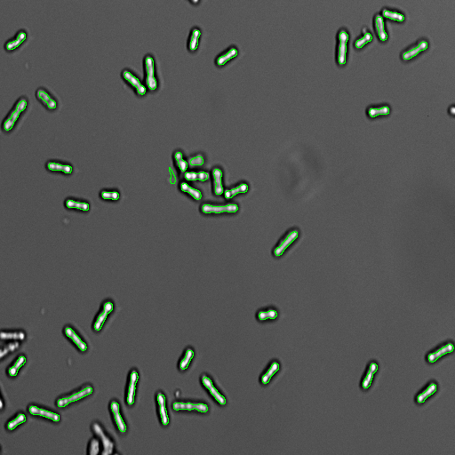

# Day 4 Exercises - Macro Batch Processing

## Exercise Overview

In this exercise, we will work with a folder containing a time series of `.tif` images. The files follow a simple naming convention, for example:

```text
rounding_assay0000.tif
rounding_assay0001.tif
rounding_assay0002.tif
...
```

Each image shows bacterial cells at a different time point.

The goal is to build an image analysis workflow that can process this dataset automatically. We will start by developing and testing the analysis on a **single image**, and then gradually turn it into a reusable workflow that can be applied to the complete image series.

The main steps will be:

1. **Load and preprocess the images** using ImageJ/Fiji.
2. **Segment the bacterial cells** so that individual cells can be identified.
3. **Convert the segmentation into a reusable function** that can be applied to different images.
4. **Process all images in the folder automatically** using batch processing.
5. **Measure cell shape**, in particular circularity, to identify cells that are becoming rounded.
6. **Classify and color-code the cells** according to their morphology.
7. **Generate visual outputs across the time series**, making it easy to inspect how the bacterial population changes over time.

The final result should not only provide quantitative measurements, but also a **human-interpretable visualization** of the analysis. Segmented cells can be displayed using different colors depending on their morphology, allowing us to quickly identify when and where cells transition from an elongated to a rounded shape.

The idea is therefore to move from a simple analysis of one image towards a **reproducible, automated, and interpretable image analysis pipeline**.

### Example of the final output

The GIF below is a placeholder for an example solution showing the color-coded results over time:



## Exercise Files and Example Code

The `exercises` subfolder contains a series of ImageJ macro (`.ijm`) files corresponding to the different stages of this exercise.

These files are intended as **guides**, not as complete solutions that you should simply copy. If you get stuck, you can inspect the corresponding file to see one possible way of approaching the problem and then adapt it to your own workflow.

The exercises build progressively on each other. Try to solve each task yourself first. Use the example code when you need a hint, want to compare approaches, or want to understand how the individual steps can be combined into a complete workflow.

## Exercise 1

Modify this code so you can use the **Bio-Formats Importer** to open one image from the dataset, change the LUT to **Grays**, and adjust the brightness/contrast. Then, using the **Macro Recorder**, find a segmentation algorithm to segment the bacterial cells.

```ijm
data_folder = "";
tif2load = "";

run("Bio-Formats Importer", "open=C:/Users/xcamra/Desktop/Day4-Data/rounding_assay0000.tif autoscale color_mode=Composite rois_import=[ROI manager] view=Hyperstack stack_order=XYCZT");
run("Grays");
//run("Brightness/Contrast...");
run("Enhance Contrast", "saturated=0.35");

// Add here your own algorithm to segment the bacteria cells
```
Help: [Exercise 1](exercises/Exercise_1.ijm)

## Exercise 2

Save your segmentation algorithm into a function:

```ijm
function doSomething() {
    // function description
    DO HERE;
}
```

**Hint:** Pass the title of the image to segment as input; return the title of the segmented image as output.

Help: [Exercise 2](exercises/Exercise_2.ijm)
## Exercise 3

Overlay the segmentation on the original image in **green**.

**Hints:**

- ROI Manager functions
- `Draw`
- Ensure the correct image type (**RGB**)
- Do not overwrite the originals
- Save to a desired output folder

Help: [Exercise 3](exercises/Exercise_3.ijm)

## Exercise 4

Run your segmentation function on **all images in a folder** (batch processing).
Help: [Exercise 4](exercises/Exercise_4.ijm)

## Exercise 5

For a single image, compute the **circularity** of each segmented cell using ROI Manager.

**Hints:**

```ijm
run("Clear Results");
roiManager("count");
roiManager("Select", i);
roiManager("Measure");
```
Help: [Exercise 5](exercises/Exercise_5.ijm)

## Exercise 6

Color the results based on circularity:

- **Red** if the object is circular
- **Green** otherwise

**Hints:**

```ijm
getResult("Circ.", i);
```

Depending on your measurement, you may need to use `"Round"` instead of `"Circ."`.

Other useful commands include:

```ijm
setForegroundColor(...);
roiManager("Draw");
```
Help: [Exercise 6](exercises/Exercise_6.ijm)

## Exercise 7

Combine **batch processing** with **RGB overlays** to produce a video showing cells changing from **"normal"** to **"round"**.

Help: [Exercise 7](exercises/Exercise_7.ijm)

## Solutions and Additional Help

If you have completed the exercises, or if you are still stuck after using the example code in the `exercises` folder, you can find more complete solutions below.

These files show one possible implementation of each step. There are many valid ways to build the workflow, so your solution does not need to be identical.

- [Solution 1](solutions/Solution_1.ijm)
- [Solution 2](solutions/Solution_2.ijm)
- [Solution 3](solutions/Solution_3.ijm)
- [Solution 4](solutions/Solution_4.ijm)
- [Solution 5](solutions/Solution_5.ijm)
- [Solution 6](solutions/Solution_6.ijm)
- [Solution 7](solutions/Solution_7.ijm)

### Example Final Output

The animation in the example output shows an example produced by the complete workflow. Cells are color-coded according to their measured morphology, making it easier to visually follow the transition from elongated to rounded cells over time.
